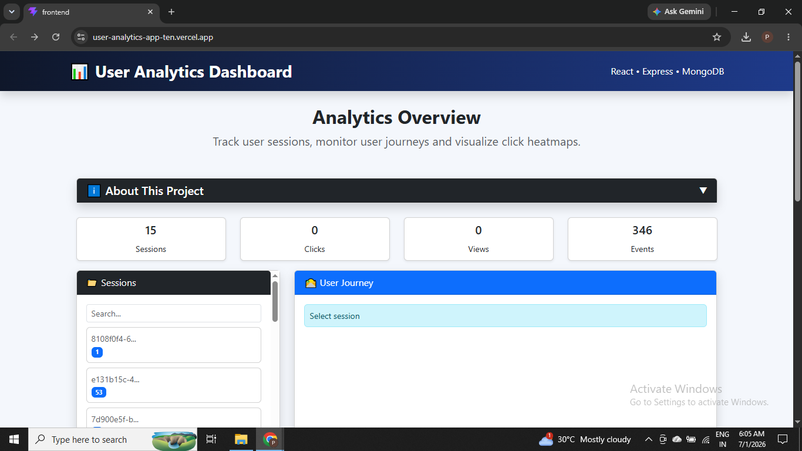
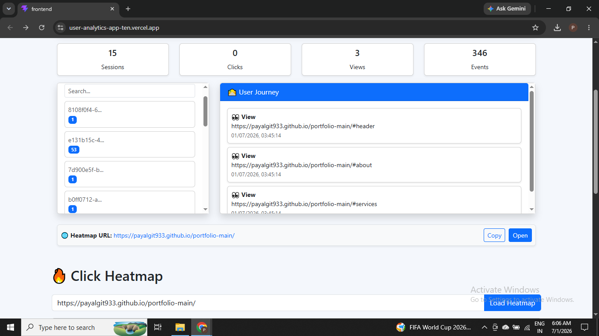
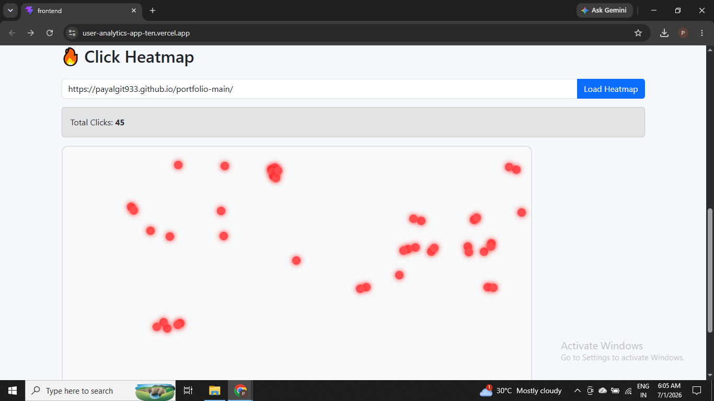

# 📊 User Analytics Dashboard

A full-stack web analytics platform that captures user interactions, stores them in MongoDB, and visualizes user behavior through an interactive dashboard featuring session tracking, user journey analysis, and click heatmaps.

---

## 🚀 Live Demo

### 🌐 Portfolio (Tracked Website)
https://payalgit933.github.io/portfolio-main/

### 📈 Analytics Dashboard
https://user-analytics-app-ten.vercel.app/

### ⚙ Backend API
https://user-analytics-app-lhpn.onrender.com/

---

## 📸 Screenshots

### Dashboard

<p align="center">

</p>

---

### User Journey

<p align="center">

</p>

---

### Heatmap

<p align="center">

</p>

---

### Portfolio Tracking

<p align="center">

</p>

---

## ✨ Features

- 📄 Automatic Page View Tracking
- 🖱 Click Event Tracking
- 👤 Session Management
- 🛣 User Journey Visualization
- 🔥 Click Heatmap
- ☁ MongoDB Atlas Integration
- ⚡ RESTful APIs
- 🌐 Fully Deployed Application
- 📱 Responsive Dashboard UI

---

## 🛠 Tech Stack

### Frontend

- React
- Vite
- Bootstrap 5
- Axios

### Backend

- Node.js
- Express.js

### Database

- MongoDB Atlas
- Mongoose

### Deployment

- Vercel (Frontend)
- Render (Backend)
- GitHub Pages (Tracked Portfolio)

---

## 🏗 Project Architecture

```
Portfolio Website
        │
        │
        ▼
 Tracker Script
        │
        ▼
 Express REST API
        │
        ▼
 MongoDB Atlas
        │
        ▼
 React Dashboard
```

---

## 📡 REST APIs

### POST `/events`

Stores user interaction events.

Request Body

```json
{
  "sessionId": "abc123",
  "eventType": "click",
  "pageUrl": "https://example.com",
  "x": 220,
  "y": 350
}
```

---

### GET `/sessions`

Returns all tracked sessions with total event counts.

---

### GET `/sessions/:sessionId`

Returns complete user journey for the selected session.

---

### GET `/heatmap?pageUrl=<page_url>`

Returns click coordinates for heatmap visualization.

---

## 📂 Folder Structure

```
user-analytics-app/

│
├── backend/
│   ├── models/
│   ├── routes/
│   ├── server.js
│   └── package.json
│
├── frontend/
│   ├── src/
│   ├── public/
│   └── package.json
│
├── tracker/
│
└── README.md
```

---

## ⚙ Installation

### Clone Repository

```bash
git clone https://github.com/payalgit933/user-analytics-app.git

cd user-analytics-app
```

---

### Backend

```bash
cd backend

npm install

node server.js
```

---

### Frontend

```bash
cd frontend

npm install

npm run dev
```

---

## 🧪 How to Test

1. Open the Portfolio Website.

2. Navigate through different sections and click around the page.

3. Open the Analytics Dashboard.

4. Select the latest session to view the complete User Journey.

5. Enter the Portfolio URL in the Heatmap section to visualize click locations.

Portfolio URL:

```
https://payalgit933.github.io/portfolio/
```

---

## 💡 Assumptions

- Session IDs are generated and stored in Local Storage.
- Each browser represents a unique user session.
- Click coordinates are recorded relative to the browser viewport.
- MongoDB Atlas is used for persistent event storage.

---

## 🔮 Future Improvements

- Authentication & User Login
- Real-time Analytics using WebSockets
- Interactive Charts & Graphs
- Session Filtering
- Search & Pagination
- Browser & Device Analytics
- Export Reports (CSV/PDF)
- Automatic Heatmap Generation
- Dashboard Statistics

---

## 👩‍💻 Author

**Payal Kumari**

GitHub:
https://github.com/payalgit933

LinkedIn:
www.linkedin.com/in/payal-g933

Email:
payal.it933@gmail.com

---

## ⭐ If you found this project useful, consider giving it a Star!
